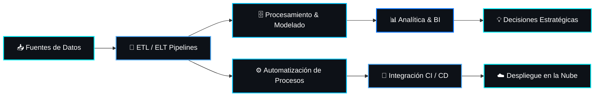

# 👋 Hola, soy **Edinsson Gonzalez**

<p align="center">
  
</p>

<p align="center">
  
</p>

<p align="center">
  <a href="https://github.com/shepro28031628">
    
  </a>
  <a href="https://github.com/shepro28031628?tab=followers">
    
  </a>
</p>

<p align="center">
  
</p>

---

## 🧠 Sobre mí & Enfoque Principal

Soy profesional especializado en **Analítica de Datos, Big Data, Automatización de Procesos e Integración de Sistemas**.

Mi objetivo es transformar datos complejos en soluciones **automatizadas, escalables y orientadas a valor**, conectando la infraestructura tecnológica con la visión estratégica de negocio.

Actualmente fortalezco mi perfil hacia **Data Engineering, Analytics Engineering y Automatización Empresarial**.

```text
📊 Data Analytics & Visualización Avanzada
🔄 Pipelines ETL / ELT & Data Engineering
⚙️ Automatización de Procesos Empresariales (RPA / Workflows)
🗄️ Modelamiento y Procesamiento de Bases de Datos (SQL / NoSQL)
🐳 Contenerización & Despliegues Continuos (Docker, CI/CD)
🔗 Integración de Sistemas & Servicios API
📈 Inteligencia de Negocios (BI) & Métricas Clave
🚀 Integración de IA para Optimización Organizacional
```

---

## 🎬 Demostración & Multimedia

<div align="center">
  <h3>🧠 Inteligencia Artificial & Automatización Inteligente</h3>
  <video src="./inteligencia%20artificial.mp4" width="85%" controls autoplay loop muted></video>
</div>

<br/>

<div align="center">
  <h3>🎨 Diseño de Interfaz de Usuario & Experiencia de Usuario (UI/UX)</h3>
  <video src="./Dise%C3%B1o%20de%20interfaz%20de%20usuario%20y%20experiencia%20de%20usuario.mp4" width="85%" controls autoplay loop muted></video>
</div>

<br/>

<p align="center">
  
</p>

---

## 🏆 Reconocimientos & Logros (GitHub Trophies)

<p align="center">
  <a href="https://github.com/ryo-ma/github-profile-trophy">
    
  </a>
</p>

---

## 🛠️ Stack Tecnológico & Herramientas

<div align="center">
  <h3>💻 Lenguajes & Scripting</h3>
  

  <br/><br/>

  <h3>📊 Data Analytics, BI & Engineering</h3>
  <p>
    
    
    
    
    
  </p>

  <h3>🗄️ Bases de Datos & Almacenamiento</h3>
  
  

  <br/><br/>

  <h3>☁️ Cloud, DevOps & Automatización</h3>
  
</div>

---

## 🚀 Arquitectura & Flujo de Trabajo (Pipeline de Datos)



<p align="center">
  <b><code>Datos ➔ Procesos ➔ Automatización ➔ Información ➔ Impacto Organizacional</code></b>
</p>

---

## 📈 Métricas & Estadísticas de GitHub

<p align="center">
  
  
</p>

<p align="center">
  
</p>

---

## 🐍 Gráfico de Contribuciones Animado (Snake Animation)

<p align="center">
  
</p>

---

## 📊 Pilares de Especialización

<table align="center">
<tr>
<td align="center" width="25%">

### 📊
**Data Analytics**
<br>
Transformación y modelado de datos para descubrir insights valiosos y patrones de negocio.

</td>
<td align="center" width="25%">

### 🔄
**Data Engineering**
<br>
Construcción de pipelines robustos, limpios y escalables de datos end-to-end.

</td>
<td align="center" width="25%">

### ⚙️
**Automation**
<br>
Optimizaciones de procesos repetitivos mediante flujos inteligentes e integración.

</td>
<td align="center" width="25%">

### 🔗
**Integration**
<br>
Conexión de APIs, microservicios y sistemas heterogéneos para interoperabilidad.

</td>
</tr>
</table>

---

## 📂 Áreas de Desarrollo & Proyectos

* 📊 **Data Analytics & BI**: Cuadros de mando, reportes interactivos y modelos analíticos.
* 🔄 **ETL & Data Pipelines**: Arquitecturas de extracción, limpieza y procesamiento masivo.
* ⚙️ **Process Automation**: Flujos automatizados para reducir tiempos operativos.
* 🔗 **Systems Integration**: Conexión e intercambio seguro de datos vía REST APIs y microservicios.
* 🧠 **AI & Smart Workflows**: Implementación de modelos de IA para optimizar la toma de decisiones.

---

## 🤝 Conectemos

<p align="center">
  <a href="https://github.com/shepro28031628">
    
  </a>
  <a href="https://www.linkedin.com/">
    
  </a>
</p>

<p align="center">
  
</p>

<p align="center">
  <b>⚡ Transformando datos en soluciones. Automatizando procesos. Construyendo el futuro.</b>
</p>
