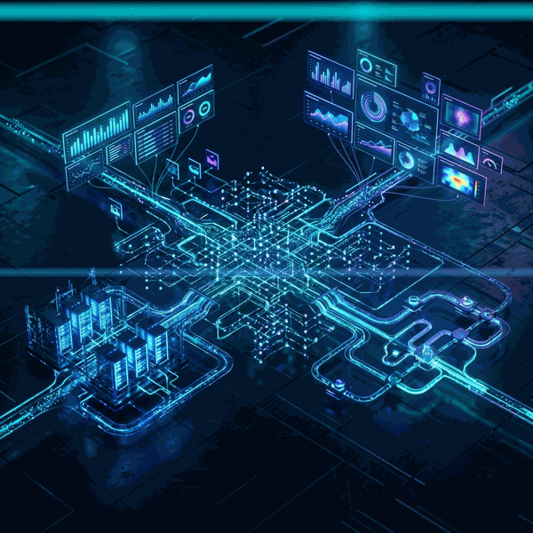
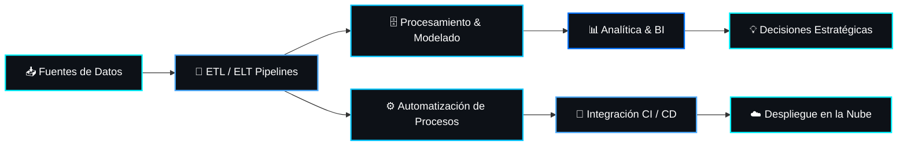

# 👋 Hola, soy **Edinsson Gonzalez**

<p align="center">
  
</p>

<p align="center">
  
</p>

<!-- Navegación Rápida -->
<p align="center">
  <a href="#-terminal--resumen-ejecutivo"><b>💻 Resumen</b></a> •
  <a href="#-sobre-m%C3%AD--enfoque-principal"><b>📊 Sobre Mí</b></a> •
  <a href="#-stack-tecnol%C3%B3gico--herramientas"><b>⚙️ Stack</b></a> •
  <a href="#-arquitectura--flujo-de-trabajo-pipeline-de-datos"><b>🚀 Arquitectura</b></a> •
  <a href="#-vitrina-de-proyectos-destacados-project-showcase"><b>📂 Proyectos</b></a> •
  <a href="#-conectemos--colaboraciones"><b>🤝 Contacto</b></a>
</p>

<p align="center">
  <a href="https://github.com/shepro28031628">
    
  </a>
  <a href="https://github.com/shepro28031628?tab=followers">
    
  </a>
  
</p>

<!-- Galería visual compacta a 2 columnas con GIFs animados -->
<table width="100%" align="center">
  <tr>
    <td width="50%" align="center" valign="top">
      
      <br/><sub><b>💻 Entorno & Terminal de Datos (Animado)</b></sub>
    </td>
    <td width="50%" align="center" valign="top">
      
      <br/><sub><b>🔄 Visualización de Pipelines & Data Analytics (Animado)</b></sub>
    </td>
  </tr>
</table>

<p align="center">
  
</p>

## 💻 Terminal & Resumen Ejecutivo

```bash
edinsson@data-terminal:~$ init_profile.sh --user="Edinsson Gonzalez"

[INFO] Cargando especialidades...
🔹 Especialidad: Data Analytics | Data Engineering | Automation | Systems Integration
🔹 Filosofía: "Transformar datos sin procesar en decisiones estratégicas automatizadas."
🔹 Estado Actual: Construyendo soluciones de datos de alto impacto & optimizando pipelines ETL.

[STATUS] Todos los sistemas operando al 100% 🚀
```

<p align="center">
  
</p>

## 📊 Sobre mí & Enfoque Principal

Soy profesional especializado en **Analítica de Datos, Big Data, Automatización de Procesos e Integración de Sistemas**.

Mi objetivo es transformar datos complejos en soluciones **automatizadas, escalables y orientadas a valor**, conectando la infraestructura tecnológica con la visión estratégica de negocio.

Actualmente fortalezco mi perfil hacia **Data Engineering, Analytics Engineering y Automatización Empresarial**.

<table width="100%" align="center">
<tr>
<td width="33%" align="center" valign="top">
  <h4>📊 Data Analytics</h4>
  <sub>Análisis exploratorio, modelos estadísticos, BI y cuadros de mando interactivos.</sub>
</td>
<td width="33%" align="center" valign="top">
  <h4>🔄 Data Engineering</h4>
  <sub>Pipelines ETL/ELT automatizados, arquitectura de datos y optimización SQL/NoSQL.</sub>
</td>
<td width="33%" align="center" valign="top">
  <h4>⚙️ Process Automation</h4>
  <sub>Automatización de flujos operativos, integración de APIs y herramientas de IA.</sub>
</td>
</tr>
</table>

<p align="center">
  
</p>

## ⚡ Muestra de Código (Data Pipeline Sample)

```python
# pipeline_example.py - Proceso ETL Automatizado de Ejemplo
import pandas as pd
from datetime import datetime

class DataPipeline:
    def __init__(self, source_url: str):
        self.source = source_url
        
    def extract_and_transform(self) -> pd.DataFrame:
        """Extrae, limpia y enriquece los datos de entrada."""
        raw_data = pd.read_csv(self.source)
        clean_df = raw_data.dropna().drop_duplicates()
        clean_df['processed_at'] = datetime.utcnow()
        return clean_df

    def load_to_warehouse(self, df: pd.DataFrame, target_table: str):
        """Carga los datos procesados a la base de datos empresarial."""
        print(f"🚀 [ETL] Cargando {len(df)} registros limpios en {target_table}...")

if __name__ == "__main__":
    pipeline = DataPipeline(source_url="s3://data-warehouse/raw/daily_sales.csv")
    data = pipeline.extract_and_transform()
    pipeline.load_to_warehouse(data, target_table="analytics.fact_sales")
```

<p align="center">
  
</p>

## 🧠 Demostración & Multimedia

<table width="100%" align="center">
  <tr>
    <td width="50%" align="center" valign="top">
      <h4>🧠 Inteligencia Artificial & Automatización</h4>
      <video src="./inteligencia%20artificial.mp4" width="100%" controls autoplay loop muted style="border-radius: 8px;"></video>
    </td>
    <td width="50%" align="center" valign="top">
      <h4>🎨 Diseño UI/UX & Experiencia de Usuario</h4>
      <video src="./Dise%C3%B1o%20de%20interfaz%20de%20usuario%20y%20experiencia%20de%20usuario.mp4" width="100%" controls autoplay loop muted style="border-radius: 8px;"></video>
    </td>
  </tr>
</table>

<p align="center">
  
</p>

## 🏆 Hitos & Especializaciones

<p align="center">
  
  
  
  
</p>

<blockquote align="center">
  💡 <i>"Sin datos, solo eres otra persona con una opinión."</i> — <b>W. Edwards Deming</b>
</blockquote>

<p align="center">
  
</p>

## ⚙️ Stack Tecnológico & Herramientas

<div align="center">
  <h3>💻 Lenguajes & Scripting</h3>
  

  <br/><br/>

  <h3>📊 Data Analytics, BI & Engineering</h3>
  <p>
    
    
    
    
    
  </p>

  <h3>🗄️ Bases de Datos & Almacenamiento</h3>
  
  

  <br/><br/>

  <h3>☁️ Cloud, DevOps & Automatización</h3>
  
</div>

<p align="center">
  
</p>

## 🛡️ Metodologías & Prácticas de Ingeniería

<table width="100%" align="center">
<tr>
<td width="25%" align="center" valign="top">
  <b>🔄 DataOps & CI/CD</b>
  <br/><sub>Automatización de pipelines y pruebas continuas.</sub>
</td>
<td width="25%" align="center" valign="top">
  <b>📐 Clean Code</b>
  <br/><sub>Código modular, mantenible y documentado.</sub>
</td>
<td width="25%" align="center" valign="top">
  <b>🔒 Data Governance</b>
  <br/><sub>Seguridad, privacidad y calidad de datos.</sub>
</td>
<td width="25%" align="center" valign="top">
  <b>🚀 Agile / Scrum</b>
  <br/><sub>Desarrollo iterativo centrado en valor rápido.</sub>
</td>
</tr>
</table>

<p align="center">
  
</p>

## 🚀 Arquitectura & Flujo de Trabajo (Pipeline de Datos)



<p align="center">
  <b><code>Datos ➔ Procesos ➔ Automatización ➔ Información ➔ Impacto Organizacional</code></b>
</p>

<p align="center">
  
</p>

## ✨ Dashboard de Métricas & Actividad GitHub

<table width="100%" align="center">
  <tr>
    <td width="50%" align="center" valign="top">
      
    </td>
    <td width="50%" align="center" valign="top">
      
    </td>
  </tr>
  <tr>
    <td colspan="2" align="center" valign="top">
      
    </td>
  </tr>
</table>

<p align="center">
  
</p>

<p align="center">
  
</p>

## 🐍 Gráfico de Contribuciones Animado (Snake Animation)

<p align="center">
  
</p>

<p align="center">
  
</p>

## 📂 Vitrina de Proyectos Destacados (Project Showcase)

<table width="100%" align="center">
<tr>
<td width="50%" valign="top">

### 📊 Pipelines & Data Analytics
- 🔄 **ETL Automated Engine**: Procesamiento masivo de fuentes de datos con Python y SQL.
- 📈 **BI Executive Dashboard**: Visualizaciones interactivas de métricas clave de negocio.
- 🗄️ **Modelado Multidimensional**: Diseño de esquemas en estrella y copo de nieve.

</td>
<td width="50%" valign="top">

### ⚙️ Automatización & Cloud
- 🤖 **Intelligent Workflow Automation**: Integración de APIs e IA para automatizar flujos complejos.
- 🐳 **Dockerized Services**: Microservicios de datos aislados y desplegados mediante CI/CD.
- ☁️ **Cloud Data Operations**: Integración de pipelines en entornos Azure.

</td>
</tr>
</table>

<p align="center">
  
</p>

## ❓ Preguntas Frecuentes & Metodología de Trabajo

<details>
  <summary><b>🛠️ ¿Cuál es mi enfoque de trabajo principal?</b></summary>
  <br/>
  Combino las mejores prácticas de <b>Clean Architecture</b>, desarrollo guiado por datos (Data-Driven) y automatización orientada a resultados empresariales escalables.
</details>

<details>
  <summary><b>💬 ¿En qué tipo de proyectos suelo participar?</b></summary>
  <br/>
  Proyectos de arquitectura e ingeniería de datos, optimización de consultas SQL/NoSQL, construcción de dashboards ejecutivos e integración de APIs con modelos de Inteligencia Artificial.
</details>

<p align="center">
  
</p>

## 🤝 Conectemos & Colaboraciones

<p align="center">
  <a href="https://github.com/shepro28031628">
    
  </a>
  <a href="https://www.linkedin.com/in/edinsson-gonzalez">
    
  </a>
</p>

<p align="center">
  
</p>

<p align="center">
  <b>⚡ Transformando datos en soluciones. Automatizando procesos. Construyendo el futuro.</b>
</p>
