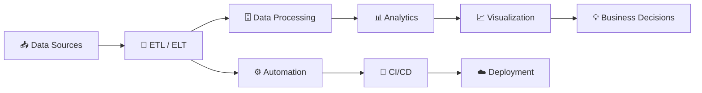

# 👋 Hola, soy **Edinsson Gonzalez**

### 🚀 Data Analytics | Big Data | Automation | Systems Integration

<p align="center">
  
</p>

<p align="center">
  <a href="https://github.com/shepro28031628">
    
  </a>
  
</p>

---

## 🧠 Sobre mí

Soy profesional enfocado en **Analítica de Datos, Big Data, Automatización de Procesos e Integración de Sistemas**.

Me interesa transformar procesos complejos en soluciones **automatizadas, escalables y orientadas a datos**, conectando tecnología, información y estrategia para generar resultados medibles.

Actualmente estoy fortaleciendo mi perfil hacia **Data Engineering, Analytics Engineering y automatización empresarial**.

```text
📊 Data Analytics
🔄 ETL / ELT & Data Pipelines
⚙️ Process Automation
🗄️ Database & SQL
🐳 Containerization
🔗 Systems Integration
📈 Business Intelligence
🚀 DevOps & CI/CD
```

---

## 🔭 Actualmente estoy trabajando en

* 📊 Analítica y visualización de datos
* 🔄 Construcción y optimización de pipelines ETL/ELT
* ⚙️ Automatización de procesos empresariales
* 🔗 Integración de sistemas y APIs
* 🗄️ Modelamiento y procesamiento de datos
* 🐳 Contenerización de aplicaciones con Docker
* 🚀 Automatización de despliegues mediante CI/CD
* 🧠 Aplicación de IA para optimización de procesos

---

## 🛠️ Stack Tecnológico

### 👨‍💻 Lenguajes

<p>
  
</p>

### 📊 Data & Analytics

<p>
  
  
  
  
</p>

### ⚙️ Data Engineering & Automation

<p>
  
</p>

### 🗄️ Bases de Datos

<p>
  
  
</p>

### ☁️ Cloud & DevOps

<p>
  
</p>

---

## 🚀 Mi enfoque



> **Datos → Procesos → Automatización → Información → Decisiones**

---

## 📈 GitHub Analytics

<p align="center">
  
  
</p>

<p align="center">
  
</p>

---

## 🐍 Actividad de GitHub

<p align="center">
  
</p>

---

## 📊 Mis áreas de interés

<table align="center">
<tr>
<td align="center" width="200">

### 📊

**Data Analytics**

Análisis y transformación de datos para generar insights.

</td>

<td align="center" width="200">

### 🔄

**Data Engineering**

Diseño de pipelines y procesos ETL/ELT.

</td>

<td align="center" width="200">

### ⚙️

**Automation**

Automatización de procesos repetitivos y empresariales.

</td>

<td align="center" width="200">

### 🔗

**Integration**

Conexión de plataformas, APIs y sistemas.

</td>
</tr>
</table>

---

## 🎯 Objetivo Profesional

> **Crear soluciones tecnológicas impulsadas por datos que permitan automatizar procesos, optimizar recursos y generar impacto real en las organizaciones.**

Mi objetivo es seguir evolucionando hacia proyectos donde converjan:

**Data + Automation + Engineering + Business**

---

## 📂 Proyectos destacados

🔹 **Data Analytics**
Proyectos de análisis, limpieza, transformación y visualización de datos.

🔹 **ETL & Data Pipelines**
Procesos automatizados para extracción, transformación y carga de información.

🔹 **Systems Integration**
Integración de aplicaciones mediante APIs y servicios.

🔹 **Process Automation**
Automatización de procesos empresariales para mejorar eficiencia y reducir tareas manuales.

🔹 **AI & Intelligent Automation**
Aplicación de inteligencia artificial para optimizar procesos y apoyar la toma de decisiones.

---

## 🤝 Conectemos

<p align="center">

<a href="https://github.com/shepro28031628">

</a>

<a href="https://www.linkedin.com/">

</a>

</p>

---

<p align="center">
  
</p>

<p align="center">
  <b>⚡ Transformando datos en soluciones. Automatizando procesos. Construyendo futuro.</b>
</p>
